## FoodPlus

Trata-se de uma aplicação para compra de refeições com baixo teor calórico. Os usuários podem navegar entre as opções e montar sua refeição adicionando items ao carrinho.

O projeto possui 14 páginas:

- ```/```: Página inicial;
- ```/sauces```: Selecionar temperos;
- ```/veggies```: Selecionar verduras;
- ```/cheese```: Selecionar queijo;
- ```/crunch```: Selecionar nozes e items similares;
- ```/extras```: Selecionar outros items extras;
- ```/admin```: Exibe o dashboard do admin, habilitado somente se o usuário possuir role admin; 
- ```/admin/add-product```: Exibe um formulário para que o admin adicione um novo item; 
- ```/admin/all-products```: Exibe todos os items cadastrados; 
- ```/admin/edit-product```: Exibe um produto a ser editado após o administrador selecionar o mesmo na tabela disponível em /admin/all-products; 
- ```/checkout```: Página para o usuário confirmar o pedido; 
- ```/signin```: Exibe opções de login configuradas no NextAuth, Google e Github; 
- ```/account```: Exibe os dados do usuario logado e os pedidos; 
- ```/404```: Página que é acionada caso o usuário tente acessar uma página inexistente; 


## Sumário

- [Tecnologias utilizadas](#tecnologias)
- [Instruções para rodar o projeto](#instrucoes)
- [Organização e estruturação do projeto](#organizacao)
- [Desenvolvimento](#desenvolvimento)
- [Imagens](#imagens)

## Tecnologias Utilizadas <a name="tecnologias"></a>

### Frontend

- [**NextJS**](https://nextjs.org/)
- [**TailwindCSS**](https://tailwindcss.com/)
- [**React Hook Form**](https://react-hook-form.com/)
- [**Yup**](https://github.com/jquense/yup/)
- [**React Redux**](https://react-redux.js.org/)
- [**Redux Tookit**](https://redux-toolkit.js.org/)
- [**React Hot Toast**](https://react-hot-toast.com/)
- [**React Icons**](https://react-icons.github.io/react-icons/)
- [**Framer Motion**](https://www.framer.com/)
- [**React Loading Icons**](https://github.com/dkress59/react-loading-icons/)
- [**Axios**](https://axios-http.com/docs/intro)


### Backend
- [**Prisma**](https://www.prisma.io/)
- [**PlanetScale**](https://planetscale.com/)
- [**NextAuth**](https://next-auth.js.org/)
- [**UUID**](https://github.com/uuidjs/uuid/)
- [**Cloudinary**](cloudinary.com)


## Instruções para rodar o projeto <a name="instrucoes"></a>

### Será necessário ter instalado na sua máquina:

```
Git
NodeJS
```

- Clone o repositório com o comando **git clone**:

```
git clone https://github.com/felipehimself/foodplus
```

- Entre no diretório que acabou de ser criado:

```
cd foodplus
```

- Faça a instalação das dependências do projeto:

```
npm install
```

- Inicialize o projeto:

```
npm run dev
```

## Organização e estruturação do projeto <a name="organizacao"></a>

O projeto está estruturado da seguinte forma:

```
│   .env
│   .eslintrc.json
│   .gitignore
│   middleware.ts
│   next-env.d.ts
│   next.config.js
│   package-lock.json
│   package.json
│   postcss.config.js
│   README.md
│   tailwind.config.js
│   tsconfig.json
│
├───.vscode
│       settings.json
│
├───components
│       AdminContainer.tsx
│       AdminHeading.tsx
│       Button.tsx
│       CardOrder.tsx
│       CardProduct.tsx
│       Cart.tsx
│       MobileCart.tsx
│       MobileNavbar.tsx
│       MobileTab.tsx
│       Navbar.tsx
│       PageLoading.tsx
│       ProductContainer.tsx
│       Sidebar.tsx
│
├───features
│       cartSlice.ts
│       showCartSlice.ts
│
├───hooks
│       useIsLoading.ts
│
├───interfaces
│       Cart.ts
│       next-auth.d.ts
│       Order.ts
│       Product.ts
│       Props.ts
│       Request.ts
│       User.ts
│
├───layouts
│       CartLayout.tsx
│       HomeLayout.tsx
│       MainLayout.tsx
│
├───lib
│       framer.ts
│       hot-toast.ts
│       prismadb.ts
│       yup.ts
│
├───pages
│   │   404.tsx
│   │   index.tsx
│   │   signin.tsx
│   │   _app.tsx
│   │
│   ├───account
│   │       index.tsx
│   │
│   ├───admin
│   │   │   index.tsx
│   │   │
│   │   ├───add-product
│   │   │       index.tsx
│   │   │
│   │   ├───all-products
│   │   │       index.tsx
│   │   │
│   │   └───edit-product
│   │           [productId].tsx
│   │
│   ├───api
│   │   ├───admin
│   │   │       index.ts
│   │   │
│   │   ├───auth
│   │   │       [...nextauth].ts
│   │   │
│   │   ├───order
│   │   │       index.ts
│   │   │
│   │   └───user
│   │           index.ts
│   │
│   ├───checkout
│   │       index.tsx
│   │
│   ├───cheese
│   │       index.tsx
│   │
│   ├───crunch
│   │       index.tsx
│   │
│   ├───extras
│   │       index.tsx
│   │
│   ├───sauces
│   │       index.tsx
│   │
│   └───veggies
│           index.tsx
│
├───prisma
│       schema.prisma
│
├───public
│       404-img.jpg
│       favicon.ico
│       image.jpeg
│       vercel.svg
│       welcome-home-webp.webp
│
├───store
│       store.ts
│
├───styles
│       globals.css
│
└───utils
        menu.tsx
```

## Desenvolvimento <a name="desenvolvimento"></a>

### Frontend

#### [**NextJS**](https://nextjs.org/)

O projeto foi desenvolvido com o framework NextJS, que tem como base o React. Foi utilizada a abordagem ```getServerSideProps```, para gerar as páginas de forma dinâmica com dados sendo servidos pelo banco de dados. A proteção de rotas e a persistência de login foram feitas por meio da utilização de middleware para validar se o usuário está autenticado por meio da verificação do token armazenado nos cookies. 

#### [**TailwindCSS**](https://tailwindcss.com/)

Para estilização dos elementos. 

#### [**React Hook Form**](https://react-hook-form.com/) e [**Yup**](https://github.com/jquense/yup/).

Para controle das informações informadas e validação dos campos dos formulários.

#### [**Redux Toolkit**](https://redux-toolkit.js.org/) e [**React Redux**](https://react-redux.js.org/)

Para controle de estados entre as telas da aplicação.

#### [**React Hot Toast**](https://react-hot-toast.com/)

Para mostrar alertas na aplicação.

#### [**React Icons**](https://react-icons.github.io/react-icons/)

Para utilização de ícones SVG na aplicação.

#### [**Framer Motion**](https://www.framer.com/)

Para animações e transições.

#### [**React Loading Icons**](https://github.com/dkress59/react-loading-icons/)

Para demonstração de espera na transição de páginas e chamadas HTTP.


#### [**Axios**](https://axios-http.com/docs/intro)

Para realização de chamadas HTTP.


### Backend

#### [**Prisma**](https://www.prisma.io/)

ORM utilizado para criar queries de consulta no banco de dados.

#### [**PlanetScale**](https://planetscale.com/)

Plataforma serverless utilizada para manter o banco de dados em MySQL.

#### [**NextAuth**](https://next-auth.js.org/)

Solução utilizada para tratar o login do usuário utilizando os clientes Google e Github. 

#### [**UUID**](https://github.com/uuidjs/uuid/)

Para gerar identificadores únicos ao salvar dados no banco de dados.

#### [**Cloudinary**](cloudinary.com)

Serviço utilizado para hospedar as imagens de cada item cadastrado na aplicação.

## Imagens <a name="imagens" ></a>

### Mobile

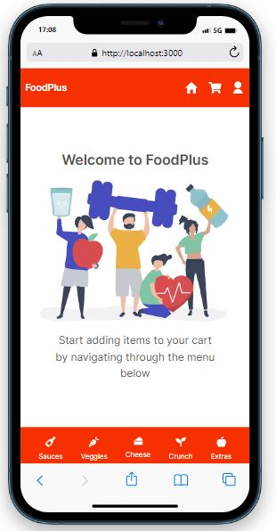 
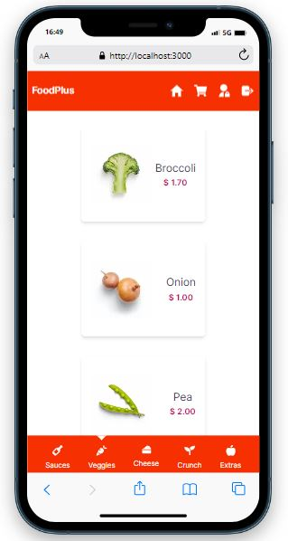 
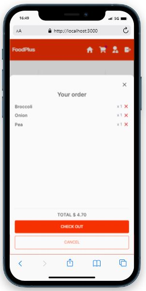 
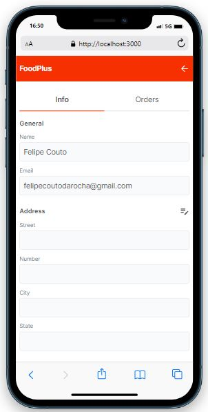 
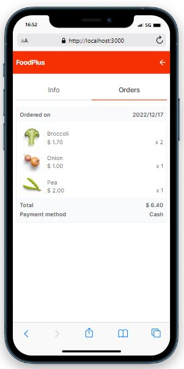 
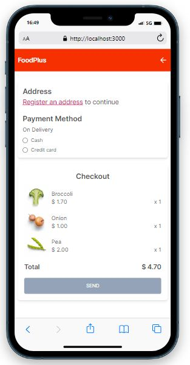 

### Desktop

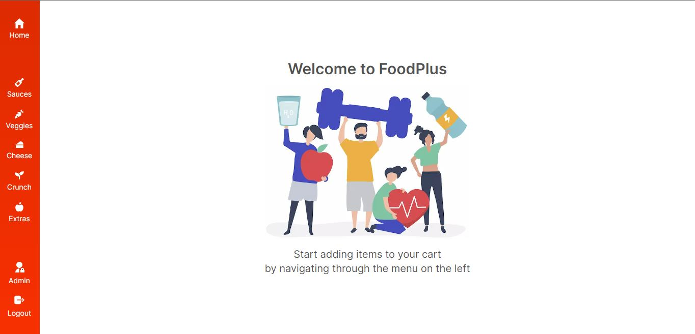 
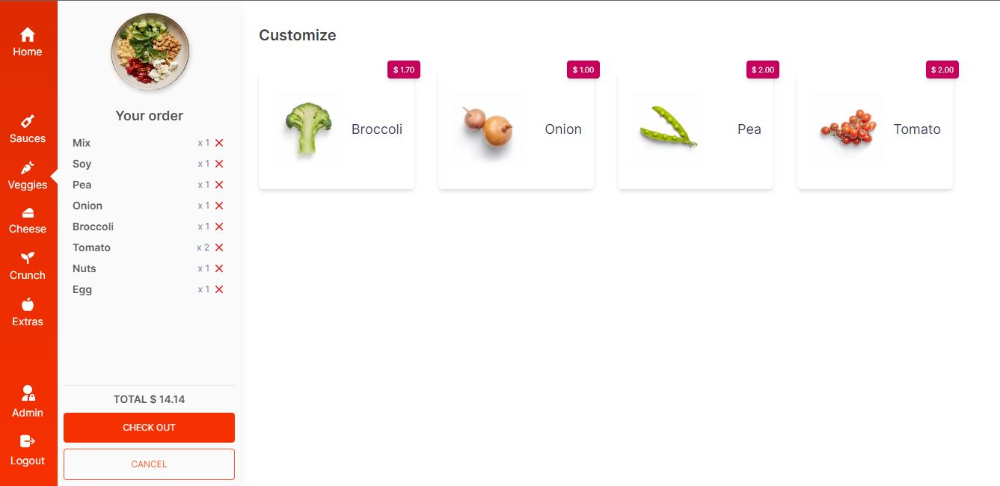 
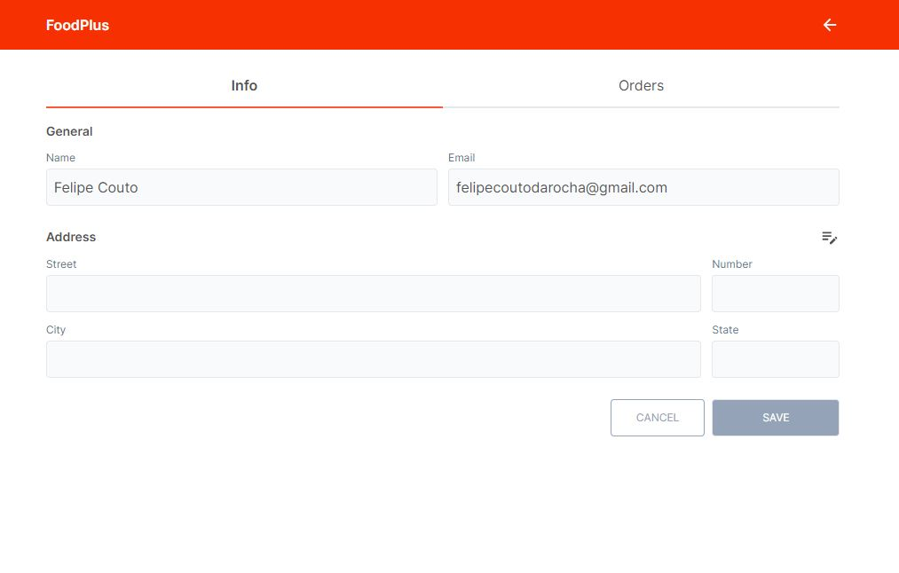 
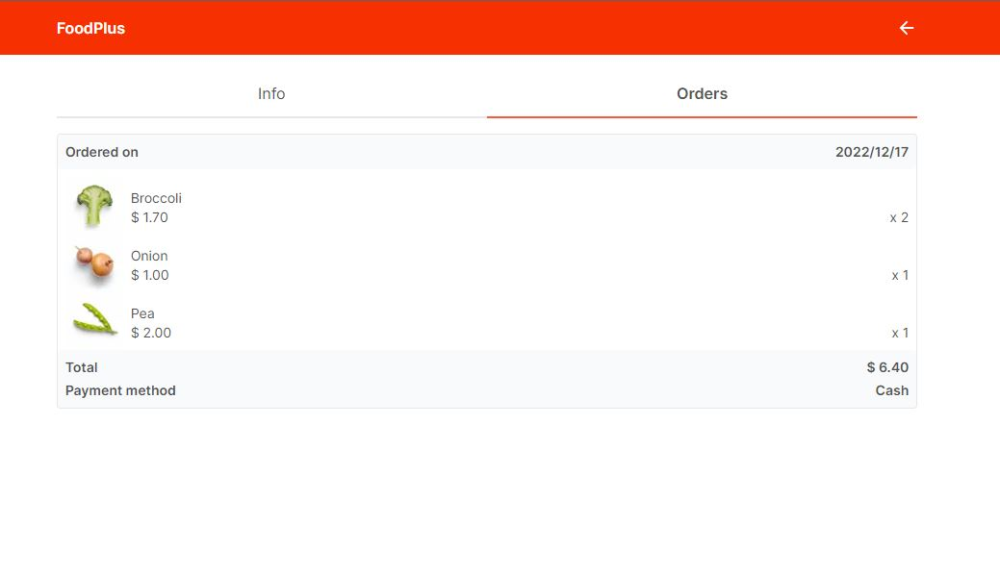 
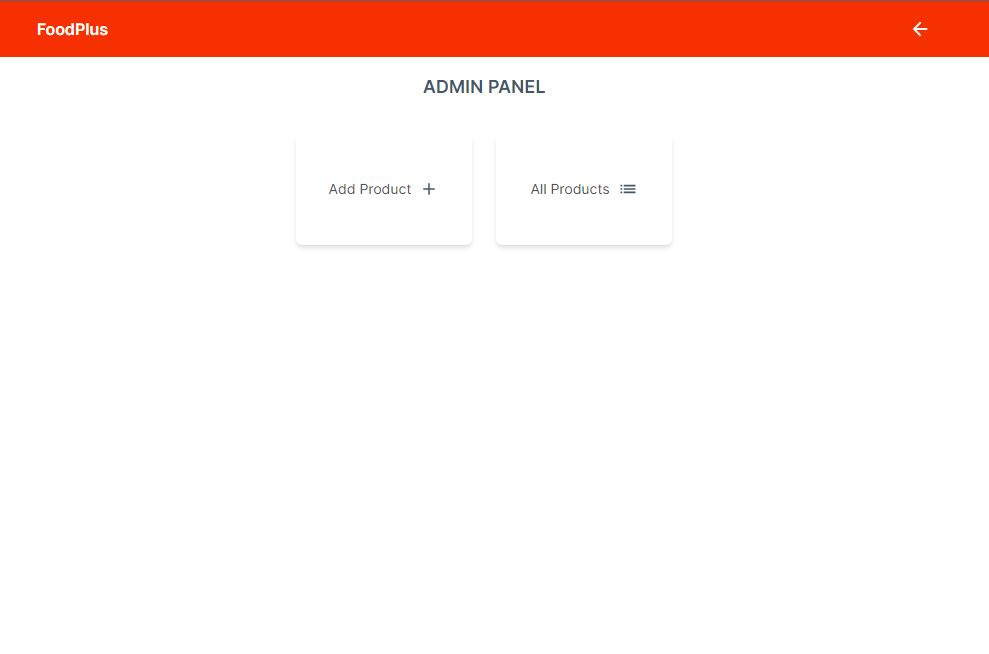 
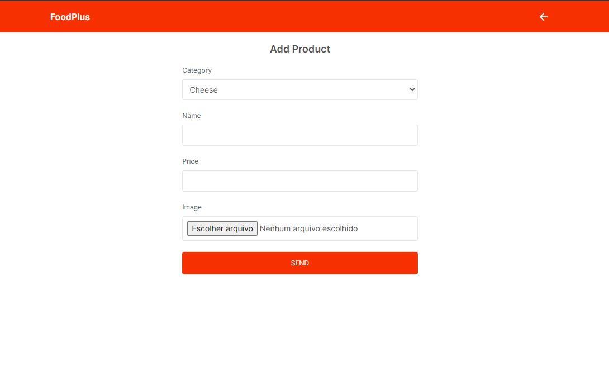 
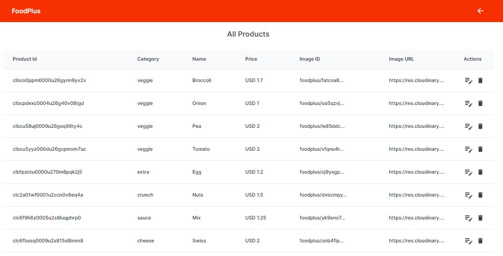 
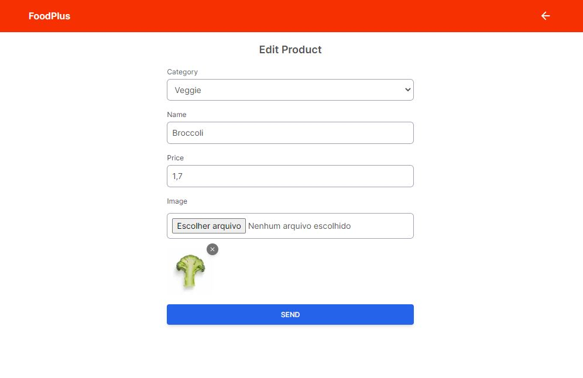 
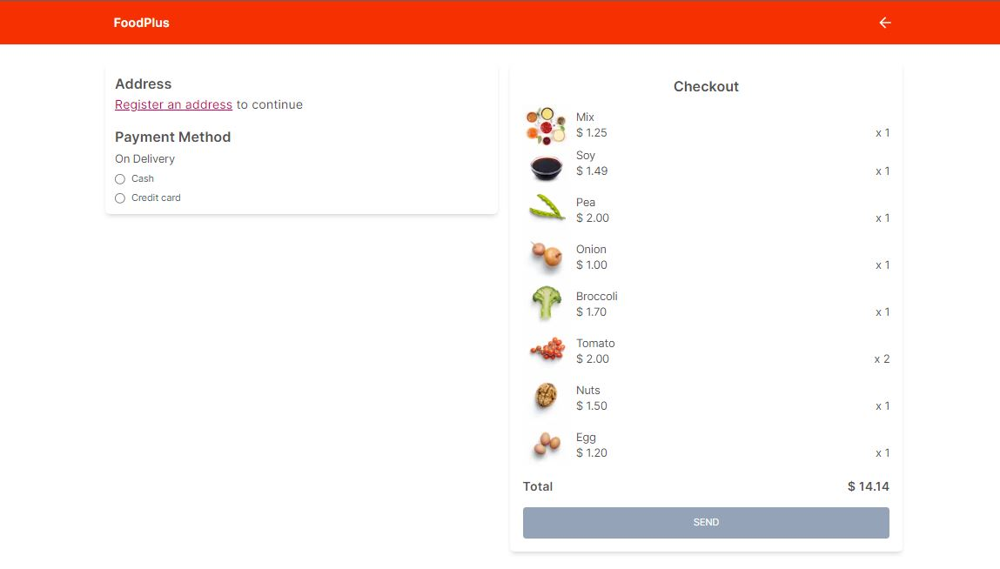 